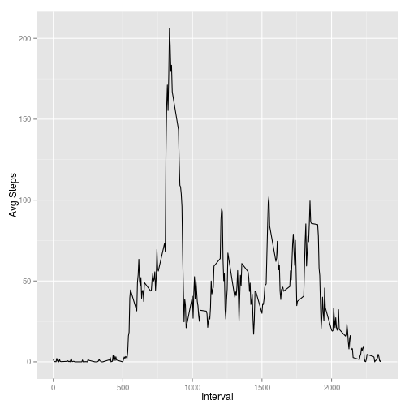
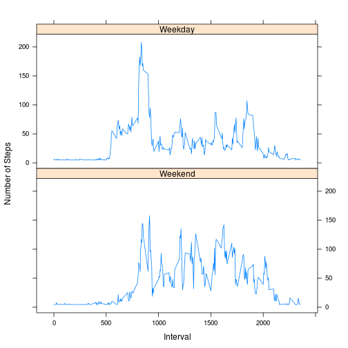

# Reproducible Research: Peer Assessment 1

## Loading and preprocessing the data


```r
act<-read.csv("activity.csv", header=TRUE)
str(act)
```

```
## 'data.frame':	17568 obs. of  3 variables:
##  $ steps   : int  NA NA NA NA NA NA NA NA NA NA ...
##  $ date    : Factor w/ 61 levels "2012-10-01","2012-10-02",..: 1 1 1 1 1 1 1 1 1 1 ...
##  $ interval: int  0 5 10 15 20 25 30 35 40 45 ...
```

```r
act$Date<-as.Date(act$date, format = "%Y-%m-%d")
head(act)
```

```
##   steps       date interval       Date
## 1    NA 2012-10-01        0 2012-10-01
## 2    NA 2012-10-01        5 2012-10-01
## 3    NA 2012-10-01       10 2012-10-01
## 4    NA 2012-10-01       15 2012-10-01
## 5    NA 2012-10-01       20 2012-10-01
## 6    NA 2012-10-01       25 2012-10-01
```

## What is mean total number of steps taken per day?

```r
tot_steps<-tapply(act$steps, act$Date, sum, na.rm=TRUE)
hist(tot_steps, xlab="Total Number of Steps Taken per Day", main="Histogram for Total Number of Steps per Day")
```

 

```r
mean<-mean(tot_steps, na.rm=TRUE)
mean
```

```
## [1] 9354
```

```r
median<-median(tot_steps, na.rm=TRUE)
median
```

```
## [1] 10395
```

## What is the average daily activity pattern?

```r
avg<-tapply(act$steps, act$interval, mean, na.rm=TRUE)
interval<-as.numeric(names(avg))

step<-as.data.frame(cbind(avg, interval))

require(ggplot2)
ggplot(step, aes(interval, avg)) + geom_line() +  xlab("Interval") + ylab("Avg Steps")
```

 


## Imputing missing values

```r
sum(is.na(act$steps)) 
```

```
## [1] 2304
```

```r
wbh<-act[,-1]
wbh$steps<-ifelse(is.na(act$steps),mean(act$steps, na.rm=TRUE), act$steps)
#str(wbh)
#head(wbh)

tot_steps1<-tapply(wbh$steps, wbh$Date, sum, na.rm=TRUE)
hist(tot_steps1, xlab="Total Number of Steps Taken per Day", main="Histogram for Total Number of Steps per Day")
```

 

## What is the mean and median after imputing of missing?


```r
mean1<-mean(tot_steps1, na.rm=TRUE)
mean1
```

```
## [1] 10766
```

```r
median1<-median(tot_steps1, na.rm=TRUE)
median1
```

```
## [1] 10766
```

## Are there differences in activity patterns between weekdays and weekends?


```r
wbh$day<-weekdays(wbh$Date)
wbh$wkd<-ifelse(wbh$day %in% c("Saturday", "Sunday"), "Weekend", "Weekday")

avg<-tapply(wbh[wbh$wkd=="Weekday",]$steps, wbh[wbh$wkd=="Weekday",]$interval, mean, na.rm=TRUE)
interval<-names(avg)
wkd<-"Weekday"
week<-as.data.frame(cbind(avg,interval,wkd))

avg<-tapply(wbh[wbh$wkd=="Weekend",]$steps, wbh[wbh$wkd=="Weekend",]$interval, mean, na.rm=TRUE)
interval<-names(avg)
wkd<-"Weekend"
week1<-as.data.frame(cbind(avg,interval,wkd))
wk<-rbind(week,week1)
require(lattice)
xyplot(as.numeric(levels(wk$avg))[wk$avg]~as.numeric(levels(wk$interval))[wk$interval] |wk$wkd, wk,layout = c(1, 2), xlab="Interval", ylab="Number of Steps",
  panel=function(x, y){
  panel.xyplot(x, y, lty=1, type="l")
}, as.table=T)
```

 

